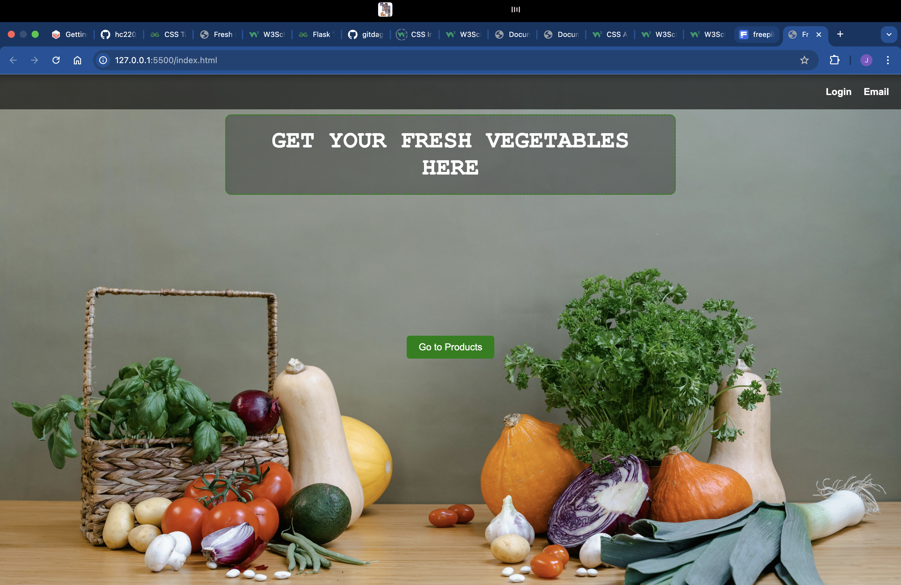
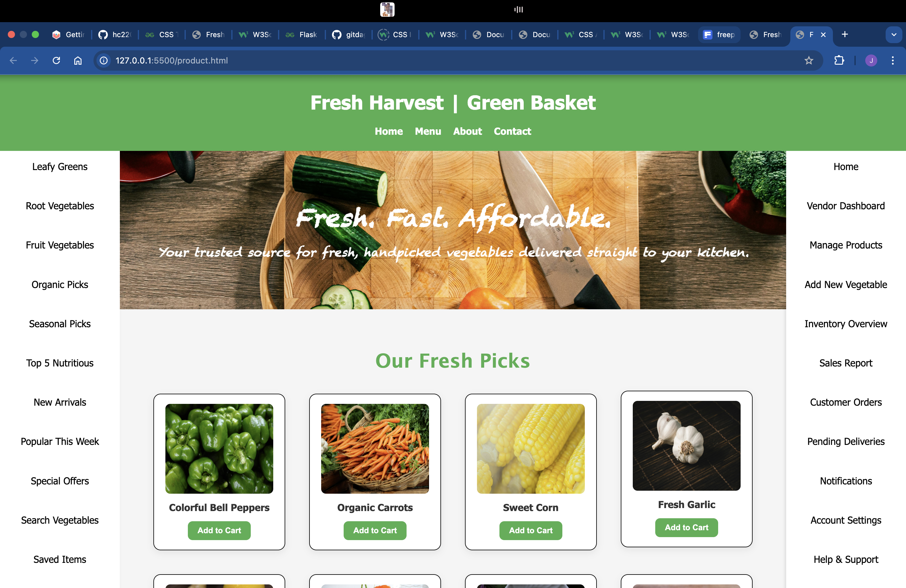
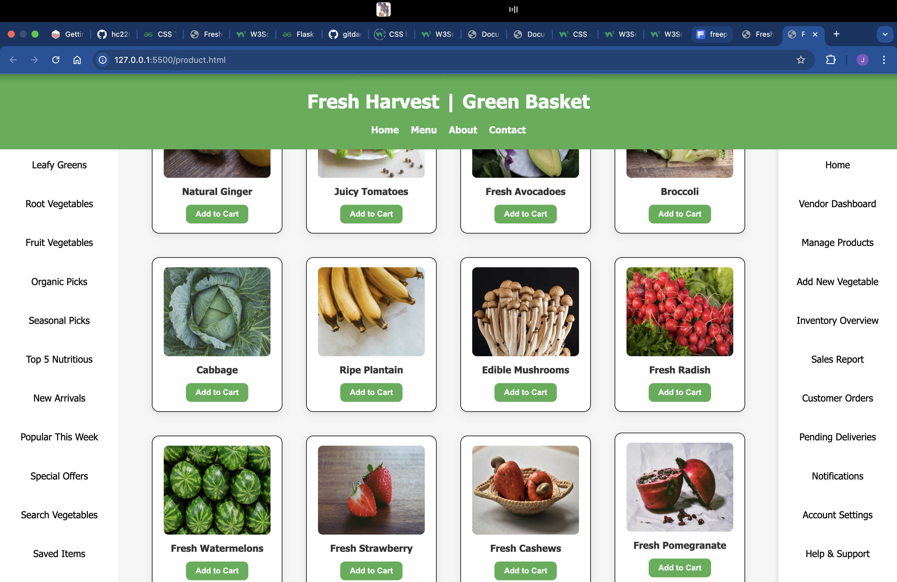
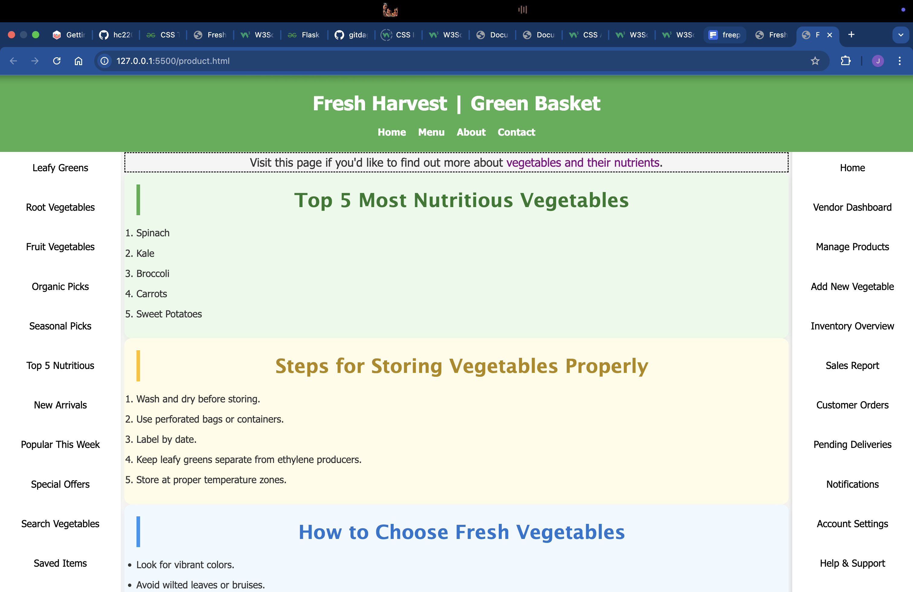

# 🥬 Fresh Harvest | Green Basket

Welcome to **Fresh Harvest**, a visually appealing and thoughtfully designed vegetable shop website crafted purely with **HTML** and **CSS**. This project serves as the foundational front-end prototype of a future e-commerce platform tailored for fresh produce lovers and small market vendors. The aim is to create a responsive and accessible online shopping experience centered around organic, farm-fresh vegetables.

This is currently a **static project**, meaning it has no backend or JavaScript functionality — yet. However, the structure is built with scalability in mind, so functionality like cart management, inventory tracking, user authentication, and database integration can easily be added in future updates.

---

## 🔍 Overview

This project includes the following key components:

- 🌐 **Homepage**  
  A welcoming landing page with a vibrant design, inviting visitors to explore the shop and learn more about its offerings. It includes links to the product listings and contact section.

- 🔐 **Login Page** *(Design Only)*  
  A visual prototype for user authentication. It mimics a login interface but doesn't process user input yet.

- 🛒 **Product Page**  
  Displays a variety of vegetables with images, names, and an “Add to Cart” button for each item. Products are presented using responsive cards for a clean layout.

- 🧑‍🌾 **Staff Profile Page**  
  A simple profile section to introduce key team members or staff. This is linked from the contact section, providing a touch of personality to the store.

- ➕ **"Add to Cart" Buttons**  
  Each product has an "Add to Cart" button to hint at future interactivity. These currently have no functional code behind them but serve as placeholders for upcoming JavaScript or backend features.

---

## 🧱 Built With

- **HTML5** — For structured and semantic markup.
- **CSS3** — Custom styling, responsive layout, and modern design patterns.
- *(No JavaScript or frameworks used in this phase.)*

---

<h2>🙌 Contributions</h2>

Pull requests are welcome! If you'd like to contribute by adding cart functionality or improving the UI, feel free to fork the repo and submit a PR.

<h2>📃 License</h2>

This project is open source and free to use under the MIT License.

## 📸 Screenshots

